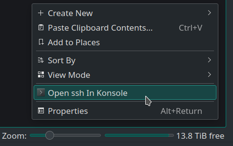

# Description

Short repository with my solution to add the functionality of opening from Dolphin (KDE file manager) a ssh terminal to the current folder. 

Summarised: create a new service where the exec passes the full address that you see in dolphin (`sftp:[or fish]//user@server:22/folder`) to a temporal file, then an auxiliary script parses that file to create the desired command into another temporal file, then run the last one in konsole.

The service (`sshInKonsole.desktop`) should be saved in `~/.local/share/kservices5/`

The auxiliary script (`aux4ssh`) should be saved somewhere in `$PATH`

Then, simply do right click in the remote folder you want to open in a separate `Konsole` terminal and should work, as shown below:

I tried to do a one liner but the multiple nested double qoutes and the time that I want to give this issue motivated me to go for the temporary files solution. Would be great if someone is able to.
